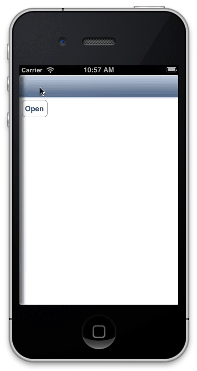

MVYSideMenu
===========

iOS Ribbon Menu based on Google+ iPhone app.



##Installation

####CocoaPods
Add `pod 'MVYSideMenu'` to your Podfile.

####Manually
Add the `MVYSideMenu` folder to your project. MVYSideMenu uses ARC. If you have a project that doesn't use ARC, just add the `-fobjc-arc` compiler flag to the MVYSideMenu files.

##Usage

###Basic Setup

In your app delegate:
```objective-c
#import "MVYSideMenuController.h"

- (BOOL)application:(UIApplication *)application didFinishLaunchingWithOptions:(NSDictionary *)launchOptions {

  // Create your menu view controller
  MVYMenuViewController *menuVC = [[MVYMenuViewController alloc] initWithNibName:@"MVYMenuViewController" bundle:nil];
  // Create your main content view controller
  MVYContentViewController *contentVC = [[MVYContentViewController alloc] initWithNibName:@"MVYContentViewController" bundle:nil];

  // Initialize the MVYSideMenuController
  MVYSideMenuController *sideMenuController = [[MVYSideMenuController alloc] initWithMenuViewController:menuVC contentViewController:contentVC options:options];

  // Add to the window
  self.window.rootViewController = sideMenuController;
  [self.window makeKeyAndVisible];
  
  return YES;
}
```

You can also initialize it with your custom options:

```objective-c
MVYSideMenuOptions *options = [[MVYSideMenuOptions alloc] init];
options.menuViewOverlapWidth = 60.0f;
options.bezelWidth = 15.0f;
options.contentViewScale = 0.9f; // 1.0f to disable scale
options.contentViewOpacity = 0.5f; // 0.0f to disable opacity
options.panFromBezel = NO;
options.panFromNavBar = YES;
options.animationDuration = 0.3f;
  
MVYSideMenuController *sideMenuController = [[MVYSideMenuController alloc] initWithMenuViewController:menuVC contentViewController:contentVC options:options];
```

###Accessing it from a Child View Controller

You only need to import `MVYSideMenu` in your view controller

```objective-c
#import "MVYSideMenu.h"

MVYSideMenuController *sideMenuController = [self sideMenuController];
```

### Closing and Opening menu
```objective-c
// Close menu animated
[sideMenuController closeMenu];

// Open menu animated
[sideMenuController openMenu];
```

### Changing view controllers
```objective-c
OtherContentViewController *otherContentVC = [[OtherContentViewController alloc] initWithNibName:@"OtherContentViewController" bundle:nil];
[sideMenuController changeContentViewController:otherContentVC closeMenu:YES];

OtherMenuViewController *otherMenuVC = [[OtherMenuViewController alloc] initWithNibName:@"OtherMenuViewController" bundle:nil];
[sideMenuController changeMenuViewController:otherMenuVC closeMenu:YES];
```

## Requirements

Requires iOS 5.0 and ARC.

## Contributing

Forks, patches and other feedback are welcome.

## Creator

[Álvaro Murillo](http://github.com/alvaromurillo)
[@alvaromurillop](https://twitter.com/alvaromurillop)

## License

MVYSideMenu is available under the MIT license. See the LICENSE file for more info.
